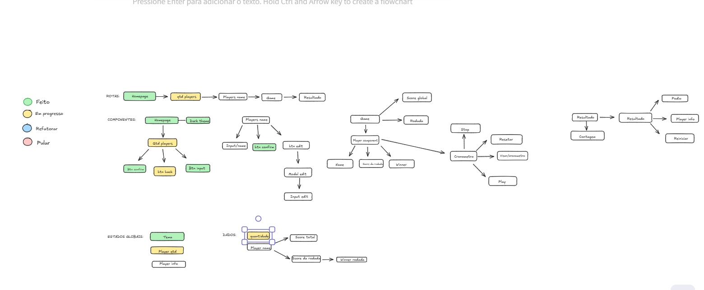

# 🕹️ Rummikub Assistant


## 🛒 Sobre o Projeto

O assistente rummikub é um site feito para auxiliar amantes do jogo de mesa 'Rummikub' a otimizar a jogatina por meio do calculo de pontuações e rankeamento de jogadores em tempo real, dessa forma , os participantes podem somente medir esforços para planejar a melhor estratégia, ao invés de realizar somatórios extenuantes.


Site: https://rummikub-assistant.vercel.app/  
---


## ✨ Funcionalidades

-   ✅ **Calculo de pontuação por rodada** Registre e tenha o resultado calculado através do sistema de pontuação integrado as regras do rummikub.
-   ✅ **Visualização de resultado total** Obtenha o resultado parcial das rodadas anteriores e o resultado total da partida (Rankeado de acordo com a pontuação por jogador e ordem descrescente no pódio).
-   ⏳**Sistema de cronometro**  Obtenha um cronometro integrado a cada box de jogador para medição do tempo de jogada em tempo real, bem como registro de tempo investido por cada jogador. (Funcionalidade em desenvolvimento)
-   ⏳ **Calculadora integrada** Calculadora integrada ao site, visando facilitar possíveis calculos de peças manuais para futuro registro na aplicação, de modo a retirar a necessidade de calculadora externa. (Funcionalidade em desenvolvimento)


---

## 🎯 Objetivo do Projeto

O objetivo do projeto é facilitar a jogatina de jogadores , já que o modo de jogo convencional com anotações no papel é muitas das vezes desorganizado e exige que ao final de cada rodada seja necessário somar a pontuação de cada jogador perdedor para um jogador que realizou o rummikub, de maneira a extender a partida a essas soluções de pontuação e negligênciando o andamento uniforme da partida. O Rummikub assistant vem para solucionar isso!


---

## 🚀 Tecnologias Utilizadas

<p align="left">
  <a href="https://react.dev/" target="_blank" rel="noreferrer"> 
    
  </a>
  <a href="https://developer.mozilla.org/en-US/docs/Web/JavaScript" target="_blank" rel="noreferrer"> 
    
  </a>
  <a href="https://tailwindcss.com/" target="_blank" rel="noreferrer"> 
    
  </a>
  <a href="https://vitejs.dev/" target="_blank" rel="noreferrer"> 
    
  </a>
    <a href="https://reactrouter.com/en/main" target="_blank" rel="noreferrer">
    
    </a>
    <a href="https://www.framer.com/motion/" target="_blank" rel="noreferrer">
    
    </a>
    <a href="https://vercel.com/" target="_blank" rel="noreferrer">
    
    </a>
</p>

---

## 🏗️ Estrutura de Componentes

A imagem abaixo ilustra a arquitetura de componentes do projeto, mostrando o fluxo de dados (props) e o relacionamento entre eles.



---

## 💡 Próximos Passos

Como próximos passos, tenho o objetivo de:

-   [ ] Finalizar a integração com o tema `light`.
-   [ ] Implementar a feature `Cronômetro`.
-   [ ] Implementar a feature `Calculadora`.

---

## 🔧 Instruções de Instalação

Para rodar este projeto localmente, siga os passos abaixo:


1.  Abra a IDE ou editor de código a sua escolha e crie a pasta Codeshop (Ou qualquer nome a sua escolha)
   

2.  Abra o terminal (CMD, PowerShell, ou o terminal integrado da sua IDE) e clone o repositório:
    ```bash
    git clone https://github.com/Lucasmenezes08/rummikub-assistant
    ```

3.  digite o comando para abrir a pasta do projeto:
    ```bash
    cd rummikub-assistant
    ```

4.  novamente digite o comando para abrir a pasta do projeto:
    ```bash
    cd rummikub
    ```


5.  Instale todas as dependências necessárias:
    ```bash
    npm install
    ```

6.  Inicie o servidor de desenvolvimento:
    ```bash
    npm run dev
    ```

Após executar esses comandos, o projeto estará disponível em `http://localhost:5173